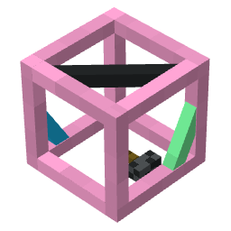

CatFrame

====

[](https://modrinth.com/mod/catframe)[](https://www.curseforge.com/minecraft/mc-mods/catframe)[](https://github.com/song682/CatFrame)[](https://codeberg.org/song682/cat-frame)   
[](https://jitpack.io/#song682/CatFrame)     

A modern rendering & UI framework for **Minecraft 1.7.10**. Backports the **26.1+ JSON model pipeline** and **1.21+ item state decision trees**, provides a **deferred render pipeline** with a per-quad extension API, a **custom texture atlas** system, a **type-safe BlockState** property system, a **data component** framework, a **tag** system with OreDict interop, and a full **component-based UI toolkit**.

---

## Modules

| Module | Key APIs | Description |
|---|---|---|
| **[JSON Model System](src/main/java/decok/dfcdvadstf/catframe/model/core)** | `ModelJson`, `ModelResolver`, `BakedModelCache` | Full 26.1+ model pipeline: `parent` inheritance, `elements` with per-face UV/rotation/cullface, `textures` with recursive `#references`, `display` transforms, blockstate variants & multipart. |
| **[ItemState Decision Tree](src/main/java/decok/dfcdvadstf/catframe/model/state/item)** | `IItemStateProvider`, `ItemStateNode` | 1.21.2+ style `items/` JSON — runtime decision tree (`condition`, `range_dispatch`, `select`, `composite`) that resolves a model per-frame from ItemStack properties. Extensible node & tint type registries. |
| **[Render Extensions + Uniform Render Pipeline](src/main/java/decok/dfcdvadstf/catframe/model/render)** | `IModelRenderExtension`, `RenderContext`, `UniformRenderPipeline`, `RenderPhase`, `RenderSubmit` | Per-quad extension chain — mods register extensions that modify color, brightness, culling, etc. before each quad is written. Thread-safe; exception-isolated. Deferred command pipeline (Extract → Submit → Render). Block world rendering writes inline to vanilla chunk Tessellator; item/GUI paths use scoped command buffers with sorted batch flush. |
| **[Atlas](src/main/java/decok/dfcdvadstf/catframe/resources/atlas)** | `CatAtlas`, `CatSprite`, `AtlasSource` | Custom texture atlas with pluggable sources: `SingleSource`, `DirectorySource`, `FilterSource`, `PalettedPermutationsSource`, `UnstitchSource`. Automatic texture collection & stitching. |
| **[Type-Safe BlockState](src/main/java/decok/dfcdvadstf/catframe/model/state/block)** | `Property<T>`, `CatStateDefinition`, `CatBlockState` | 1.8+ style typed properties (`BooleanProperty`, `IntegerProperty`, `EnumProperty`) with O(1) neighbor jump table. `CatStateInheritance` for base-class state propagation. |
| **[Data Components](src/main/java/decok/dfcdvadstf/catframe/core/component)** | `DataComponentType`, `DataComponents`, `DataComponentMap` | 1.21+ style per-ItemStack data components. Type-safe global registry, per-item defaults, NBT migration, network sync. Built-in: `ENCHANTMENT_GLINT`, `ITEM_MODEL`. |
| **[Tag System](src/main/java/decok/dfcdvadstf/catframe/tags)** | `TagLoader`, `TagKey`, `OreDict2Tag` | Modern tag system (JSON-loaded, namespaced). Bidirectional OreDict ↔ Tag conversion for gradual migration. |
| **[Recipe System](src/main/java/decok/dfcdvadstf/catframe/recipe)** | `CatFrameRecipeManager`, `ShapedTagRecipe`, `ShapelessTagRecipe` | Tag-aware shaped/shapeless crafting & smelting recipes. Recipe removal API (by output, by predicate). |
| **[UI Toolkit](src/main/java/decok/dfcdvadstf/catframe/ui)** | `Screen`, `Layout`, components | Component-based GUI framework: `Screen` base class with focus navigation & event dispatch; layouts (`Grid`, `Linear`, `Frame`, `HeaderFooter`); widgets (buttons, edit boxes, scroll areas, selection lists, tabs, toasts); overlay system with auto-stacking for both Screen and HUD contexts. |
| **[Language](src/main/java/decok/dfcdvadstf/catframe/adapter/forge/language/LanguageRegister.java)** | `LanguageRegister` | JSON lang file (`xx_xx.json`) loader — injects into Forge `LanguageRegistry` with resource-pack override support. |
| **[Search Tree](src/main/java/decok/dfcdvadstf/catframe/searching)** | `TextSearchTree`, `SuffixArray` | Suffix-array / trie-based search tree for item/block lookup. |

## Installation

```gradle
repositories {
    maven { url 'https://jitpack.io' }
}

dependencies {
    implementation 'com.github.song682:CatFrame:<version>'
}
```

> Extra extension for more mod compatibility and tools see CatFrame Compat ([Github](https://github.com/song682/CatFrame-Compat), [CodeBerg](https://codeberg.org/song682/cat-frame-compat)).

## License

**Source Code**: [MIT License](LICENSE).  
**Assets**: [All rights reserved](LICENSE-Assets) — Third-party character assets (Bluey & Bingo) are excluded from the open-source license and may not be redistributed without permission from their respective rights holders.